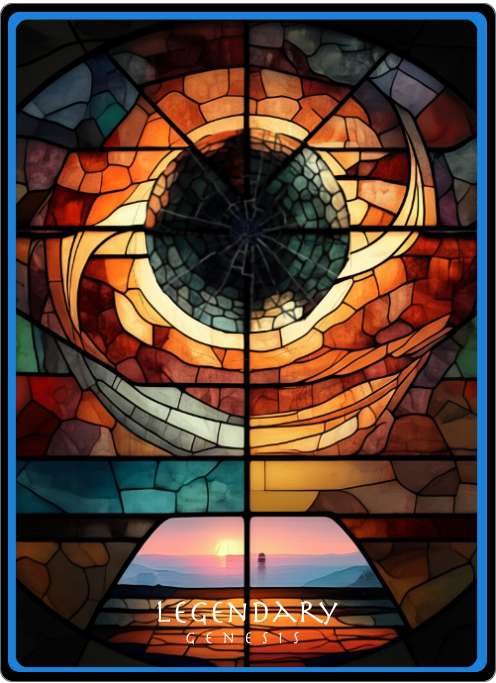
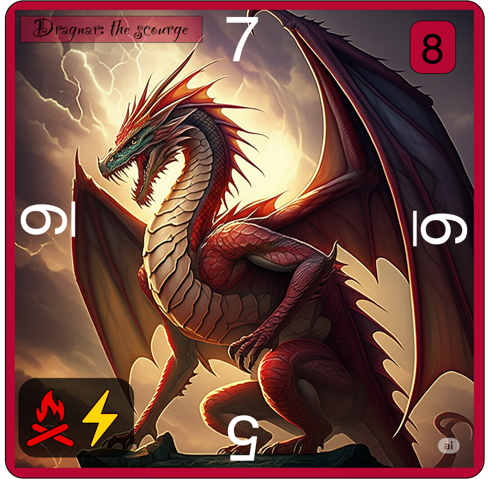
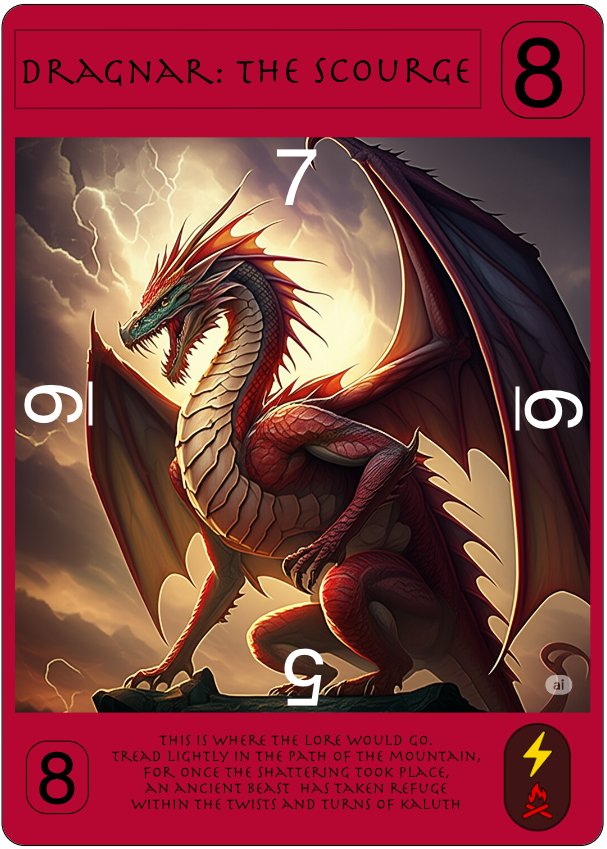
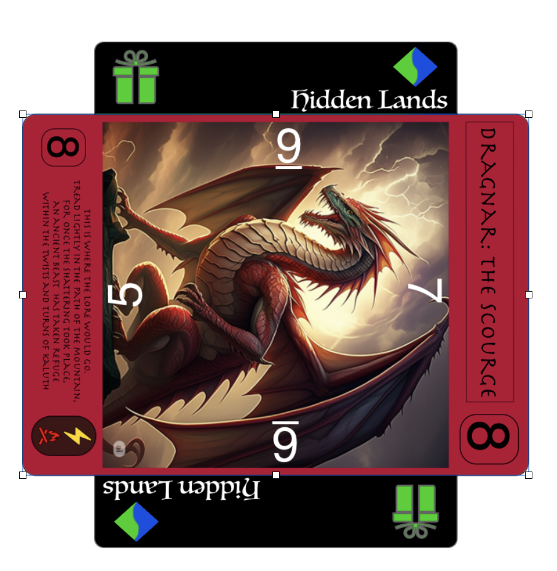
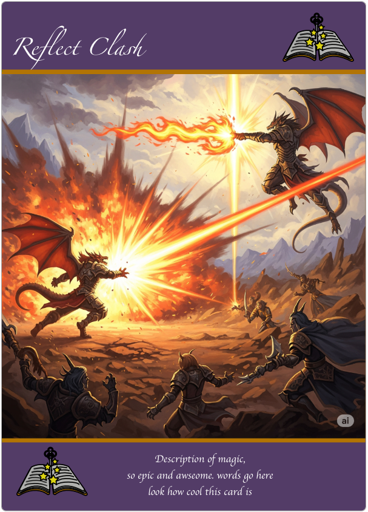
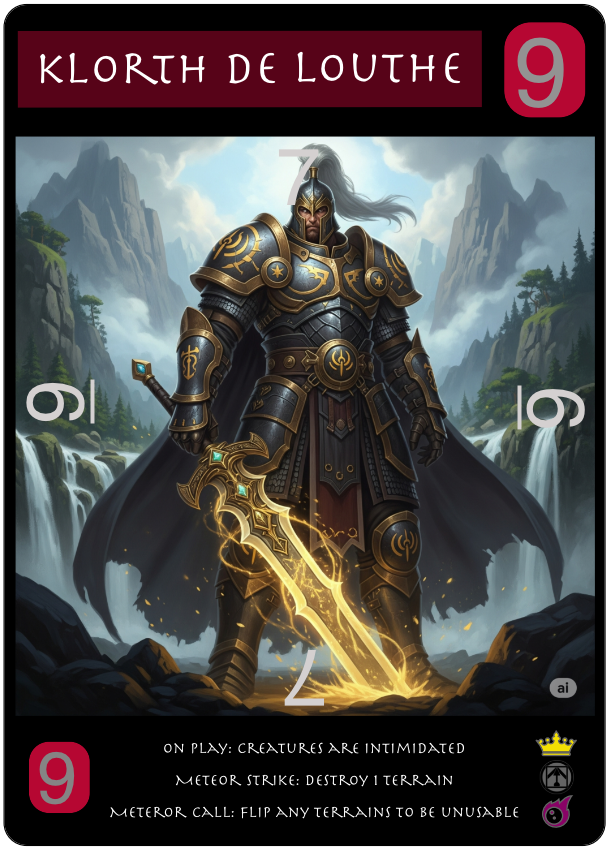

# Legendary: Origins (Creative card game)
Game_project by 37th Parallel(lateral)

1. add john to game (cave monk?)
2. add tyreese (basketball weirder)
3. add Ryan (Rianheart judge warhammer big poofy eyebrows Legend/cataclysm)
4. add Jacques as spell card the plays music to hypnotize enemies for 1 turn
5. add corina legend assassin (psych0: can remove adjacent card/ cataclysm: remove multiple but has to be even sides)

### Ideas:
- passive abilities have an icon and can be used as token-ish for other games
- 


***NAME IDEAS***

****this****

#### game modes:
- Arena (gladiator)
- Corruption (taming)
- Tactics (paths)
- War (kill the commander)
- Ruins (dungeons)
- Arise (encounters)

#### expantions:
- Shattered
- Forged
- Arise
- The Fall

# GAMEPLAY
1. single player -s
2. duel - d
3. multiplayer -m

- **game modes**
  1. Tamer type - d/m
  2. Kill the commander - d/m
  3. Path building strategy - d/m
  4. Gladiator duel - d/m
  5. Dungeon crawlers - s/m
  6. Rougelike card game (encounters based) - s

## Rules
### Tamers
- PHASE:
  1. DRAW card x1 (from spell or creature deck)
  2. Draw and place terrain card x1 
  3. place card x1 
  4. move or rotate card x1 
  5. spells unlimited 
  6. 1 cataclysm if owned and legend on board (?)instead of spells

- cannot place creature on top of other creature
- no colors matter
- most "tamed" wins
- (?)legends have a re-attack (token)
- (?)cards played in any direction
- (?)game ends when all terrains are played(timer) {30}
- (?) first creature cant be tamed/gains block for 1 turn
- movement can be done when card is summoned (motion sickness)
- draw for setup 3 (odd number) play anywhere terrain 

### Areana
- PHASE:
  1. draw
  2. 

### Kill the commander
- PHASE:
  1. draw
  2.  


### Paths to legends
- PHASE:
  1. draw
  2. 

### Dungeons
- PHASE:
  1. draw
  2. 

### Encounters
- PHASE:
  1. draw
  2. 


## Card mechanics

### ICONS
- **Movement**
  1. move enemy card
  2. move own card
  3. steadfast -cant be moved-
  4. poise -no motion sick-
- **Attack**
  1. slow -takes movement to attack- 
  2. plus 1 to attack
  3. 
- **Defense**
  1. block
  2. 
- **Deck**
  1. Draw a card
  2. 


### Design
- square cards (probably not) 
- directional card damage: 4 defense numbers, 1 attack in two places
- card effects
- symbols for abilities 



card back

### Creatures
- attack all sides at summon
- directional defense
- (?)abilities
   1. move enemy card **ETB** (M)
   2. (?)block (one turn) **ETB** (Df)
   3. mobility (M)
   4. (?)double strike (advantage/reroll) **ETB** (A)
   5. (?)range (A)
   6. haste (M)
   7. 



Square size



- name of creature
- attack value
- defense values around art
- symbols for abilities/effects
- card lore (perhaps)
- color of card depends on creature


### Terrains
- draw every turn and must play anywhere
- stackable up to 3
*needs to be bigger then creature cards to read/ or written on sides*
- certain effects apply to all creatures placed or moved onto space
- ablilities:
  1. draw a card


- card effect symbol
- name of terrain
- symbol for terrain colors
- color border around art
- description of effect (story telling)




Played together

### Spells
- one time use
- can alter/move creatures
  1. teleport
  2. draw a card



- name of spell
- spell symbol
- spell description small art border

### Legends
- user's main
- lower tier of cataclysm (like a teaser)
   1. move enemy creature (M)
   2. 



- name of legend
- attack number (silver)
- defense numbers around art (silver)
- all black with color of type
- on play effect, ability, cataclysm description w/ symbols related to it

### Cataclysm
- changes to the field in a big way
- cataclysm cards are a part of the player deck limit 1
- have to have legends on field
  1. draft (draw 5 cards and if creature must be played)
  2. assassinate (destroy equal amount of creatures)


- art full card
- nice border
- cataclysm word
- cataclysm symbol

## Board

### Design
- grid based map
- 5 X 5 (alt boards)


## Dice 

### Rules
**ATTACKS**
- dice as modifiers
<!-- - 3 d4 modifiers with plus, minus, crit hit, crit miss
    - majority wins:
```
    1. + + - = + (+1)
    2. + + C = + (+1)
    3. + + + = + (+2)
    4. - - - = - (-2)
    5. - - + = - (-1)
    6. - - C = - (-1)
    7. + - C = 0 (0)
    8. C C -/+ = C (+/- 3{2})
    9. C C C = C+/- (+4/miss)
``` -->
- "+ = +2"
- "- = -2"
- "neutral = no change"
- "crit hit = (?)+4(breaks shield for standard dmg)"
- "crit miss = miss"


**MOVE**
- move to any adjacent space with an terrain (8 ways)
- unless creature is there, or terrain says otherwise (possible abilities can use movement swaps)

## Design
**D20**
```
4 sides = -
4 sides = +
8 sides = neutral (do something with neutral)
1 side = crit hit (might have a chance for counter attack)
1 side = crit miss
```

## UI for game
(?)miniatures in game and 3d assets not just cards


## dlc
(?)expansions by environments/region
