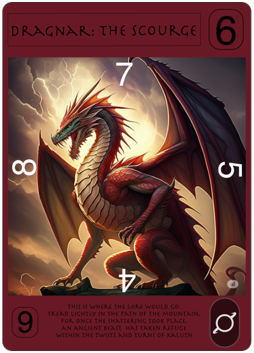
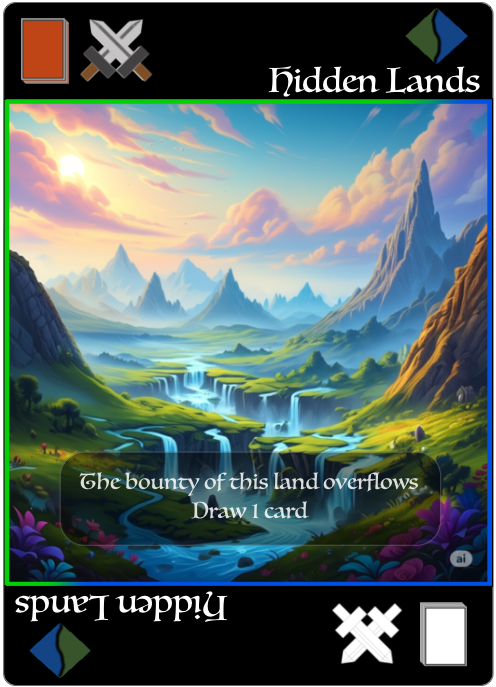

# Design

**ADD IN**
1. add john to game (cave monk?)
2. add tyreese (basketball weirder)
3. add Ryan (Rianheart judge warhammer big poofy eyebrows Legend/cataclysm)
4. add Jacques as spell card the plays music to hypnotize enemies for 1 turn
5. add corina legend assassin (psycho: can remove adjacent card/ cataclysm: remove multiple but has to be even sides)


## Card Design
- directional card damage: 4 defense numbers, 1 attack in two places
- card effects
- symbols for abilities 


card back

### Creatures
- attack all sides at summon
- directional defense



- name of creature
- attack value
- defense values around art
- symbols for abilities/effects
- card lore (perhaps)
- color of card depends on creature


### Terrains
- draw every turn and must play anywhere
- stackable up to 3
- certain effects apply to all creatures placed or moved onto space



- card effect symbol
- name of terrain
- symbol for terrain colors
- color border around art
- description of effect (story telling)


Played together

### Spells
- one time use
- can alter/move creatures


- name of spell
- spell symbol
- spell description small art border

### Legends
- user's main
- lower tier of cataclysm (like a teaser)


- name of legend
- attack number (silver)
- defense numbers around art (silver)
- all black with color of type
- on play effect, ability, cataclysm description w/ symbols related to it

### Cataclysm
- changes to the field in a big way
- cataclysm cards are a part of the player deck limit 1
- have to have legends on field


- art full card
- nice border
- cataclysm word
- cataclysm symbol

## Board Design
- grid based map
- 5 X 5 (alt boards)


5x5 board


card_ideas

## Dice Design
**D20**
```
4 sides = -
4 sides = +
8 sides = neutral (do something with neutral)
1 side = crit hit (might have a chance for counter attack)
1 side = crit miss
```